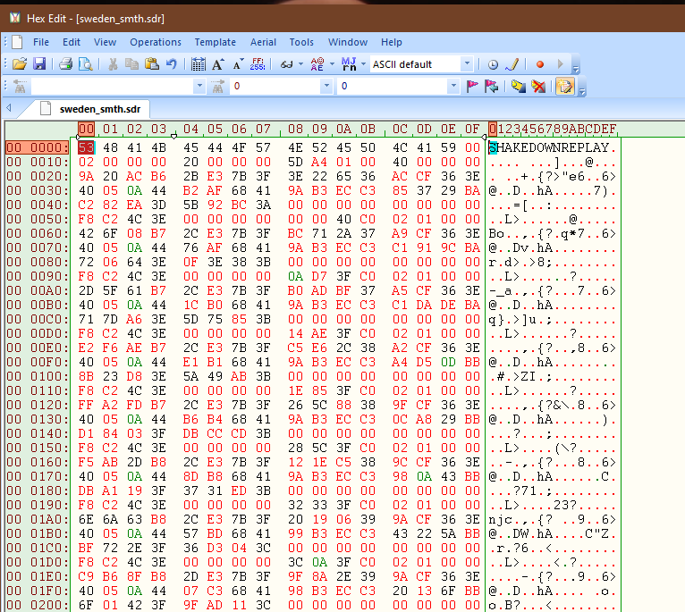
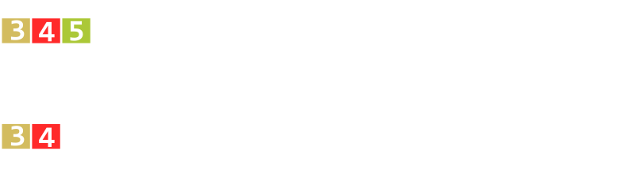
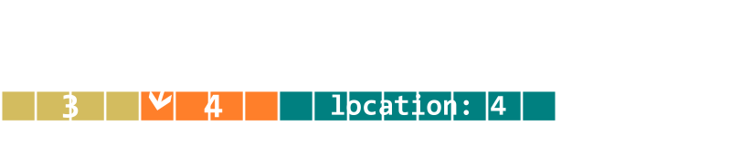
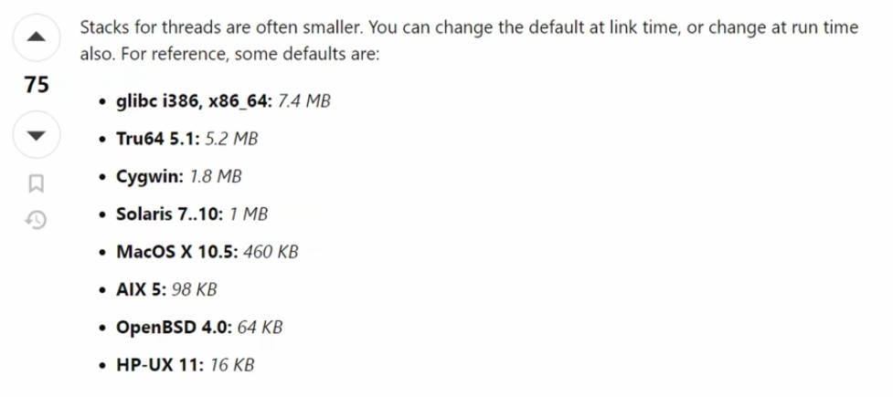
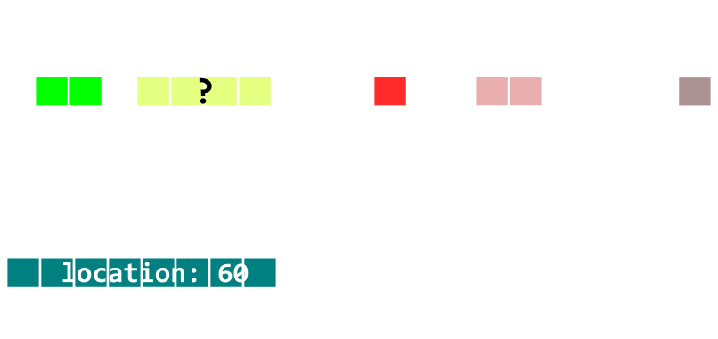
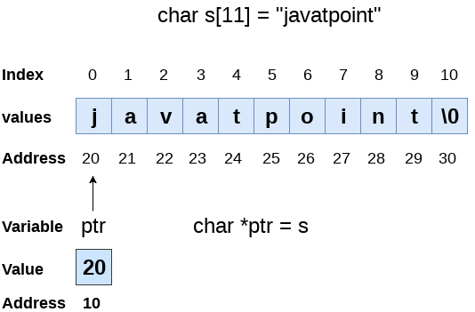
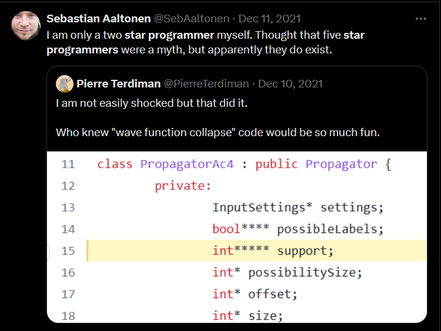
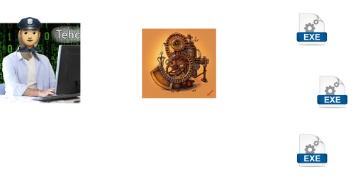
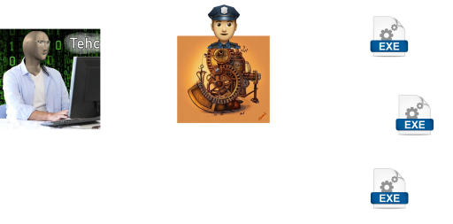
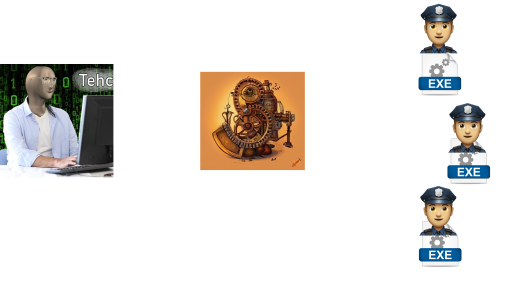

# Don't Be Afraid of Pointers

---

## Intro
- realized many people don't understand pointers
- this talk is going to have A LOT of simplifications

***

## What is memory?
- a strip of zeroes and ones
```
000000000111110101010101111111111011...
```
***

## What is memory?
- memory is split by 8 bits into bytes

```
00000000|01111101|01010101|11111111|10110111|...
```
***

## What is memory?
But, for simplicity we usually write it in hexadecimal (hex)

```
00|7D|55|FF|B7|..
```

***

## What is memory?
- Q: How many values can 1 byte have?
  - 00000000 - 11111111

***

## What is memory?
- Q: How many values can 1 byte have?
```
1B = 8b  = 256
```
- Q: And more bytes?

---

- How many values can 1, 2, 4, 8 bytes have?
```
2B = 16b = 65,536
4B = 32b = 4,294,967,296
8B = 64b = 18,446,744,073,709,551,616
```

---


---

Every byte in the memory, has an address

```
00 7D 55 FF B7 ..
0  1  2  3  4
```

---

- a3 - value
- 3 - adress - pointer
- __referencing__ - on which address is FF?
- __dereferencing__ - what is the value of 3?

Every value lives somewhere!


---

# C
- 1972; 52 years ago
- manual memory management
- clear what is on stack and what on heap

---

## Copying
```c
#include "stdio.h"

int main() {
    int a = 1;
    int b = a;

    a = 3;

    printf("a: %i, b: %i\n", a, b);
}
```

---

## But where do these values "live"?

---

## But where do these values "live"?
- in this case, on the stack


## Scope
```c
char a = 3;
char b = 4;

{
    char c = 5;
}

printf("%d", c); // error!
```

- we cannot get values outside of scope!

---

## in memory?
 

---


---

- int has 4 bytes in C
```c
int a = 3;
int b = 4;
int c = 5;

printf("%d", c);
```

.


---

What does this all have to do with pointers??

---

## Pointers
- Pointers are values (objects) that store an address
- `int*` pointer to int

---
## Referencing and dereferencing
```c
int a = 3;
int b = 4;

int* bPtr = &b;

*bPtr = 6;
```

---

- Q: What is the size of pointers?

---

- Q: What is the size of pointers?
  - 32bit (4 bytes) on 32 bit systems
  - 64bit (8 bytes) on 64 bit systems

---



---

- Pointers don't need to point to stack, but anywhere in program's memory
- stack, static, heap

---
## Stack
- pros:
  - fast allocations
  - fast access, related values are close in memory
- cons:
  - total size is limited
  - must have predictable size (at compile time)
---



---

# Heap
- dynamic memory
- pros:
  - You can have as much memory as you want* at runtime
- cons:
  - allocations are slow
  - scattered

---
# Heap in C
- allocating on the heap can be done with malloc()

```C
void* myBlockOfMemory = malloc(sizeof(int));

int* intPtr = (int*)myBlockOfMemory;

*intPtr = 34;
```

---


---
- malloc() is a syscall
- Dynamically allocated mamory must be freed!
- Dangers: use after free
- Dereferencing a null pointer

---

## Strings
- C pointers don't store the size, only the start
- Strings in C are just char* - meaning they are a simple pointer
- Strings known at compile time are stored in global memory
- strings end with a `\0` - null terminated
- _Danger:_ we can insert a 0, or we can overwrite a 0 at the end and continue

---

- strings in C

- show sample

---
- Example: Linked lists


```C++
typedef struct Node {
    int val;
    struct Node* next;
} node_t;

```

---
Pointers to pointers
- `int**` - pointer to a pointer to int

---


---
# C
## arrays
- values are contiguous in memory
- must have known size
- do not store the size

---

```C
#include <stdio.h>
#include <stdlib.h>

int main() {
    char array[4] = {1, 2, 3, 4};

    array[0] = 13;

    printf("%d", array[0]);

    return 0;
}
```

---

- In C, arrays are both values and pointers

---

## Pointer arithmetic


---

# unions
- All members at the same location in memory

---

# C++
- 1985; 39 years ago
- constructors, destructors that enable RAII
- reference types

---

# C++

Introduces reference type - int&
- can't be null
- can't be reassigned to
- reference with int& aRef = a;
- dereference with . instead of ->

---

# C++

Introduces reference type - int&
- can't be null
- can't be reassigned to
- reference with int& aRef = a;
- dereference with . instead of ->
- is not actually an object, but an alias

---

# C++
## RAII
- means Resource Acquisition Is Initialization
- classes have constructors and destructors
- memory can be managed by a class and hidden from the user

---

# Garbage Collected languages
- Java, C#, Python, Go, javascript..
- user doesn't need to think about memory
- memory usage is tracked at runtime and disposed
    - GC trades runtime cost with programmer flexibility

---

# C#
- value and reference types
- value types:
    - simple types and structs
    - on stack (or in-place)
    - always copied
    - you cannot take references out of scopes

---

```C#
struct Vector3 {
    public float x;
    public float y;
    public float z;
}
```

---

# C#
- reference types
    - class
    - memory tracked at runtime
    - usually implemented as a reference counter
    - must be created with new Person()

---
```C#
class Person {
  String name;
  int age;
  int jmbg;
}

Person person = new Person();
person.name = "Nothke";
```
---
- python, everything is a reference type..?
- go - values get allocated on the heap when grabbed as a reference
- javascript.. Depends on the browser

---

rust
- memory tracked at compile time

---
# C:


---

# Rust:


---

# GC:
 

---

## fat / wide pointers
- holds 2 values:
    - a pointer to the start
    - and a size
- C++ - `std::span<T>`, `std::string_view<T>`
- zig - []T - slice
- rust - slices

---

## what about indexing?
- Can be used instead of pointers for arrays

---

# Functional languages?

---

# Functional languages?
- we don't talk about them

---

# Functional languages?
- we don't talk about them
- Why? Because they have abstracted away memory from the user

---

That's it, thanks!
- @nothke everywhere